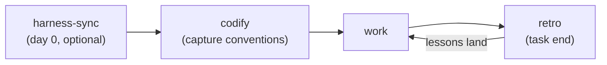

# Skills

Your AI coding agent makes the same mistake twice, ignores conventions your
project already follows, and forgets each task's lessons by the next.

The root problem predates AI: conventions that live only in your team's
heads trip every newcomer. An AI agent is simply the most demanding
newcomer you will ever onboard — it starts from zero every single session.

These skills close the loop. Your conventions get captured up front, so
the agent starts from them. Every correction becomes a lesson that — with
your consent — lands where it fits: a config, a doc, or a budgeted rule
your teammates read too. Works with Claude Code, Cursor, and any agent
that reads `AGENTS.md`.

## Skills

| Skill | What it does | When to use it |
| --- | --- | --- |
| [harness-sync](skills/harness-sync/SKILL.md) | Sets up and re-syncs a project's AI instruction files. | Optional day 0 — everything also bootstraps without it; re-run after a skills update to re-sync the managed bits. |
| [codify](skills/codify/SKILL.md) | Captures a project's existing conventions so the agent follows them from the first run. | First on an existing project, before the agent's first real task; safe to re-run as conventions evolve — it reconciles, never duplicates. |
| [retro](skills/retro/SKILL.md) | After a task, turns your corrections into durable improvements, with your consent. | At the end of every task — especially one where you corrected the agent. Saying done or wrap up triggers it too. |
| [rule-writing](skills/rule-writing/SKILL.md) | The one place rules get written — filtered, budgeted, provenance-stamped. | Mostly invoked by codify/retro handing it drafts; call it directly when you already know a landmine worth a rule. |
| [skill-writing](skills/skill-writing/SKILL.md) | Authors a new skill — for a collection, a project, or your own setup — to a tested standard. | When a procedure is worth capturing as a skill — your own idea, or a codify/retro handoff. |
| [skill-testing](skills/skill-testing/SKILL.md) | Acceptance-tests any skill with mechanical checks. | After writing or changing a skill, to prove it does what its SKILL.md says. |
| [skill-auditing](skills/skill-auditing/SKILL.md) | Audits a skills directory for stale format or facts. | Periodically, or when a skill seems outdated. |

## Install

```sh
npx skills@latest add BCGen/skills
```

Without the skill-authoring toolchain:

```sh
npx skills@latest add BCGen/skills -s harness-sync codify retro rule-writing
```

## Usage

Skills trigger automatically when your task matches, or run one on demand
(`/codify`, `/retro`, or just ask). Every skill runs standalone — none
requires another.

The typical pass:



Re-run `harness-sync` after a skills update to converge the managed
bits. The authoring trio — `skill-writing`, `skill-testing`,
`skill-auditing` — writes, tests, and audits skills of your own.

## The learning loop

Lessons live in your repo, not in any agent's private memory:

- `.ai/learnings/` — one file per lesson `retro` stages, named by root
  cause, with a status lifecycle: `candidate` (observing) → `promoted`
  (fixed somewhere better) → `resolved` (cured — the file is deleted).
- `.ai/backlog/` — one file per idea worth building later.

Commit both: plain markdown, team-shared through git — a lesson one
person's agent learns reaches everyone's next session. Entries stay
blameless (no names; authorship lives in git history).

## Why

Native agent memory is machine-local and never becomes team-shared, and
rule files that only grow eventually make the agent follow them *less*.
These skills route each lesson to the mechanism that fits — config, doc,
or rule — only with your consent, and keep rules under a hard budget, so
more lessons never mean worse adherence.

Unlike one-shot config generators, these are standalone, consent-gated,
and write each agent's native format.

## Contributing

Development setup and the spec workflow are in
[CONTRIBUTING.md](CONTRIBUTING.md).
