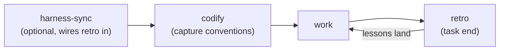

# AI Harness Skills

Your AI coding agent makes the same mistake twice, ignores conventions your
project already follows, and forgets each task's lessons by the next.

The root problem predates AI: conventions that live only in your team's
heads trip every newcomer. An AI agent is simply the most demanding
newcomer you will ever onboard — it starts from zero every single session.

These skills close the loop. Your conventions get captured up front, so
the agent starts from them. Every correction becomes a lesson that — with
your consent — lands where it fits: a config, a doc, or a budgeted rule
your teammates read too. Works with Claude Code, Cursor, and any agent
that reads `AGENTS.md`.

## Install

```sh
npx skills@latest add BCGen/skills -s harness-sync codify retro rule-writing \
  skill-auditing
```

Without the skill-authoring toolchain:

```sh
npx skills@latest add BCGen/skills -s harness-sync codify retro rule-writing
```

Update installed skills later (then re-run `harness-sync` to converge
the managed bits):

```sh
npx skills@latest update
```

## Usage

The typical pass:



1. `harness-sync` — optional; wires retro in and unifies agents, re-synced on updates.
2. `codify` — capture conventions.
3. Work as usual.
4. `retro` at each task's end — fires on its own when you wrap up; the
   loop closes.

## The learning loop

Lessons live in your repo, not in any agent's private memory:

- `.ai/learnings/` — one file per lesson `retro` stages, named by root
  cause, with a status lifecycle: `candidate` (observing) → `promoted`
  (fixed somewhere better) → `resolved` (cured — the file is deleted).
- `.ai/backlog/` — one file per idea worth building later.

Commit both: plain markdown, team-shared through git — a lesson one
person's agent learns reaches everyone's next session. Entries stay
blameless (no names; authorship lives in git history).

## Why

Native agent memory is machine-local and never becomes team-shared, and
rule files that only grow eventually make the agent follow them *less*.
These skills route each lesson to the mechanism that fits — config, doc,
or rule — only with your consent, and keep rules under a hard budget, so
more lessons never mean worse adherence.

Unlike one-shot config generators, these are standalone, consent-gated,
and write each agent's native format.
